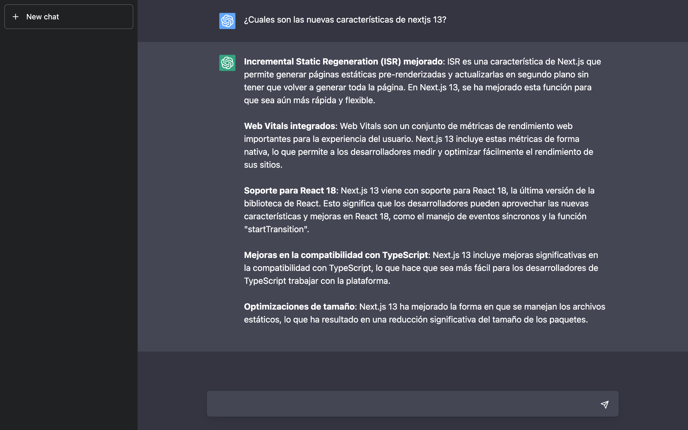
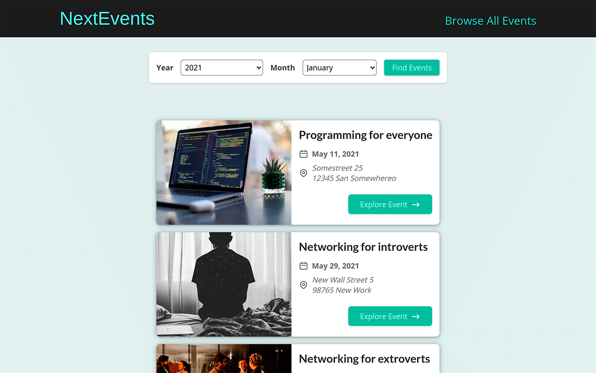
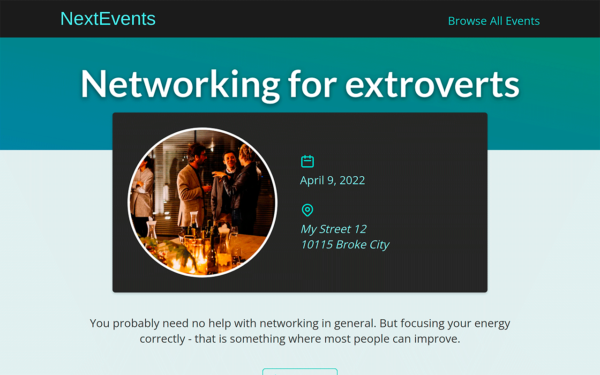
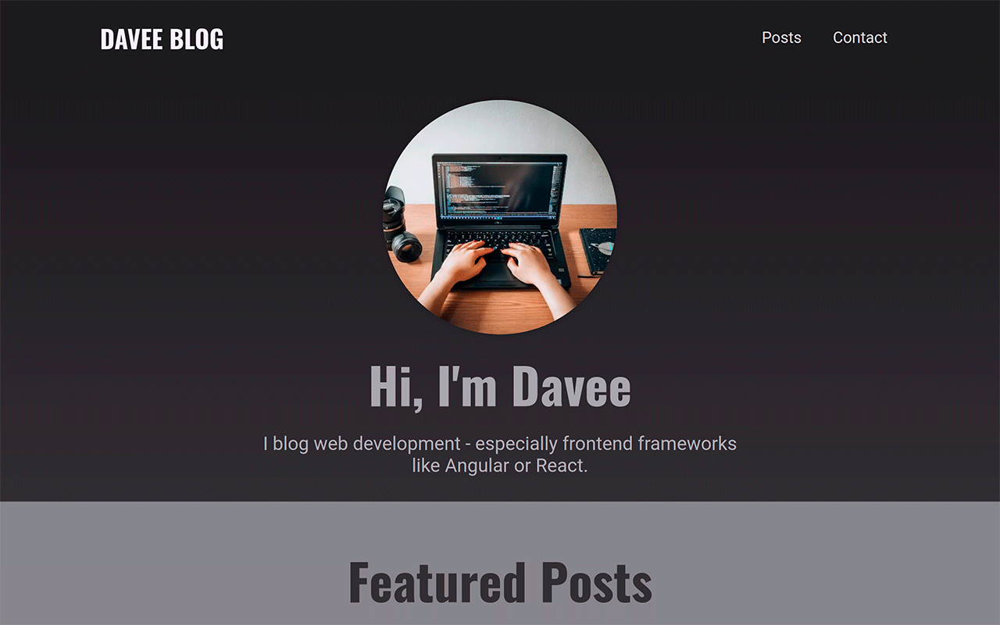
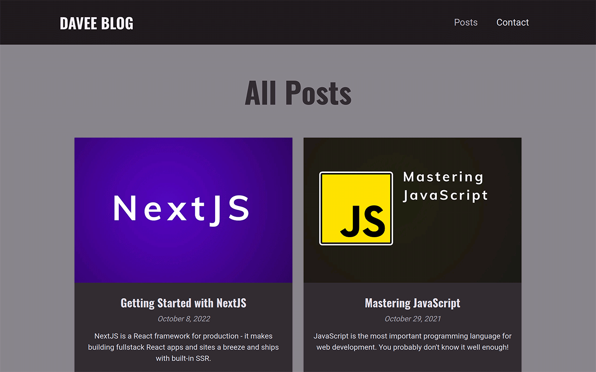
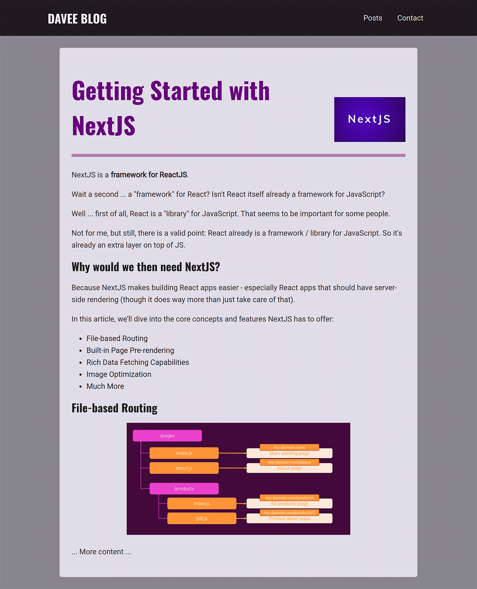
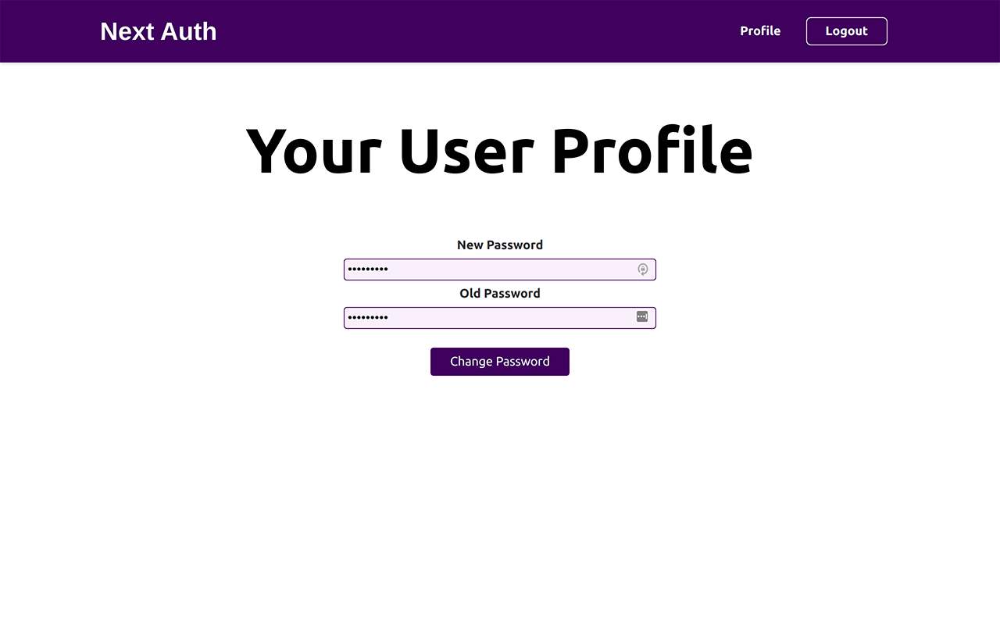

  <h1>Nest.js projects</h1>
  
  
Learning Next.js from scratch with full, production-ready apps!

## Content
### GPT chat clone with tailwindcss

### Event Workshop (mongodb connection, nextjs backend, render strategies, route system management)

### Blog Workshop (Nextjs routes API for database connections, markdown to html)
Pre-rendering and Data Fetching. Use render strategies depending on the data.

### Authentication (using next-auth, protect routes from client and from server)
